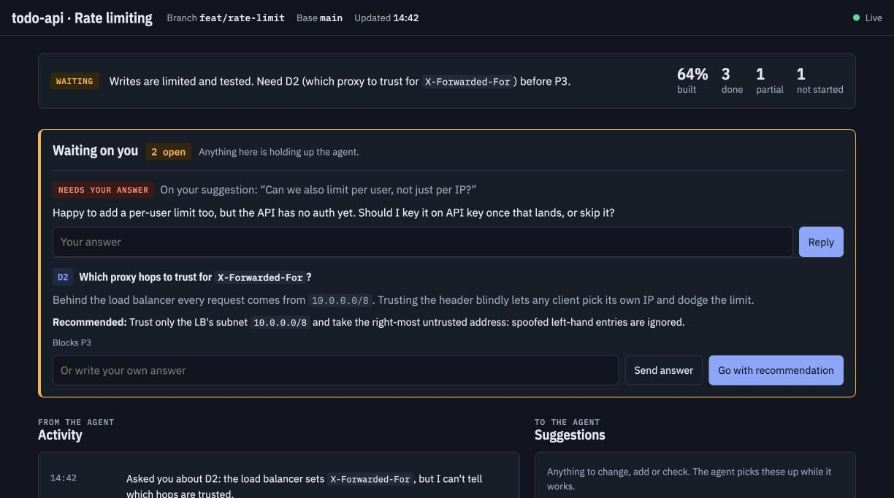
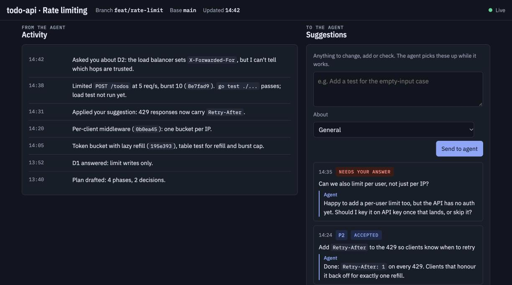
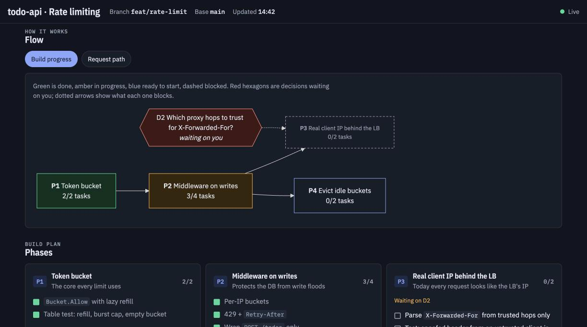
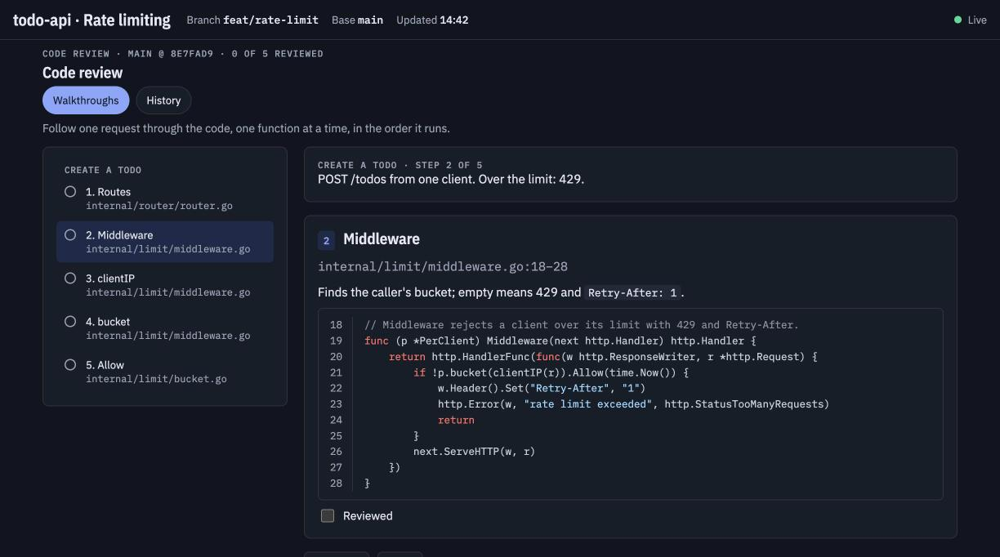
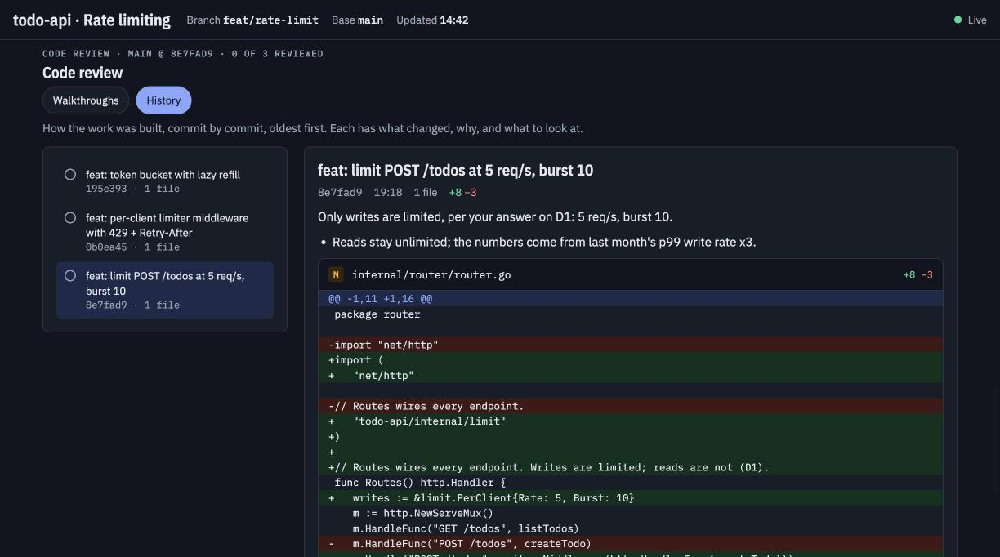

# progress-desk

A Claude Code skill that runs a local, live progress page you and Claude share while it works on a multi-step task. It shows agent status, decisions waiting on you (each with a recommendation), an activity log, a suggestion box Claude reads as you type, Mermaid flow diagrams, phases and tasks, design vs. code components, and a code review (request walkthroughs plus commit-by-commit history with diffs).

Everything runs on `127.0.0.1`. Nothing leaves your machine except the page's CDN fetches for Mermaid, highlight.js and fonts.



<details>
<summary><b>More screenshots</b>: activity and suggestions, flow, code review</summary>

**Activity and suggestions.** Messages you send reach the agent as it works; it replies on the page (accepted, declined, or a question back to you).



**Flow.** A live build-progress graph generated from phases and open decisions, plus any diagrams the agent adds.



**Code review: walkthroughs.** Follow one request through the real functions, in the order they run.



**Code review: history.** Commit by commit, with the agent's notes on what changed, why, and what to look at.



</details>

*Screenshots are from a made-up demo task (rate limiting a todo API).*

## Install

In Claude Code:

```
/plugin marketplace add shashank1503-cipher/progress-desk
/plugin install progress-desk@progress-desk
```

Then restart Claude Code. To update later, run `/plugin marketplace update progress-desk`.

**Without the plugin system:** clone the repo and copy the skill folder:

```bash
git clone https://github.com/shashank1503-cipher/progress-desk.git
cp -R progress-desk/skills/progress-desk ~/.claude/skills/
```

## Requirements

- Go 1.23+ for the server (its only dependency is `golang.org/x/net`, fetched by `go get` if it isn't already in your module cache)
- Python 3 and git for the code-review generator

See [`skills/progress-desk/SETUP.md`](skills/progress-desk/SETUP.md).

## Use

Ask Claude something like *"start a progress desk for this refactor"*, or just start a longer multi-step task and ask to follow along live. Claude starts the server, gives you the URL (default `http://127.0.0.1:8787`), and keeps the page updated as it works.

Messages you send from the page reach Claude as it works. They never authorise pushes, deploys or other outward-facing actions; Claude confirms those in chat.

## Check

```bash
cd skills/progress-desk/assets && go test ./...
```

This checks that the page loads, that a same-origin socket gets a snapshot and can post, and that other origins and non-loopback hosts are refused.
